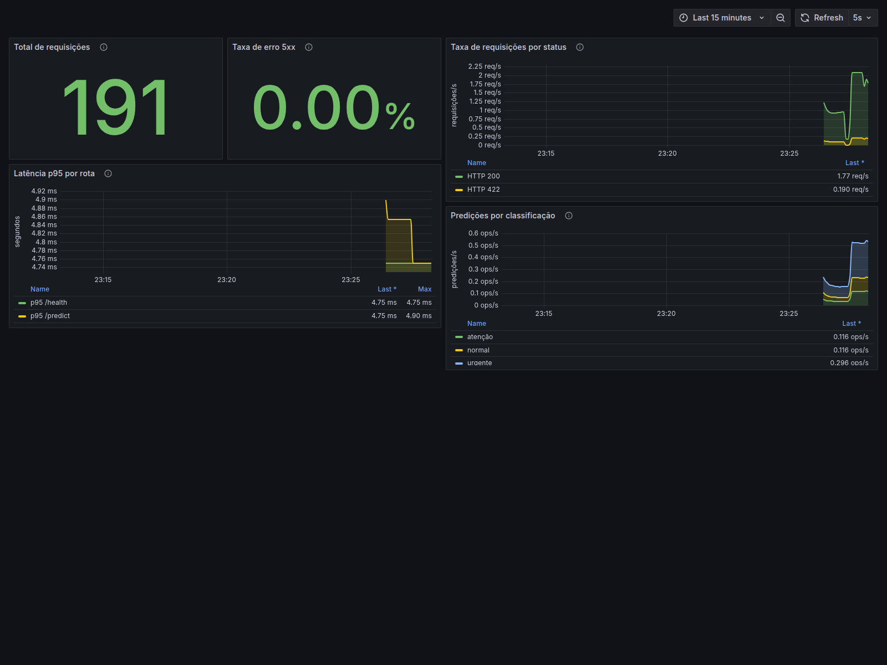

# Triagem Automática de Laudos Médicos

Tech Challenge Fase 3 (POSTECH) — sistema de triagem automática de exames de texto
(laudos médicos) que classifica a urgência do caso em **normal / atenção / urgente**,
servido via API REST (FastAPI) em container Docker.

Especificação completa do desafio em [`MLET - Tech Challenge Fase 3.pdf`](MLET%20-%20Tech%20Challenge%20Fase%203.pdf).

Este README cobre as **Etapas 1, 2 e 3** do desafio. A otimização de latência da
Etapa 4 permanece como próxima entrega.

## Etapa 1 — Decisão Arquitetural e API Inicial

### Estratégia de deploy em nuvem: batch vs. real-time

O cenário é a triagem de laudos médicos em um hospital: os textos chegam **um a um**,
conforme os exames são concluídos, e a equipe clínica precisa saber a urgência
**imediatamente** para priorizar o atendimento. Isso descarta uma arquitetura batch
(ex.: processar laudos acumulados a cada N minutos/horas) — o valor do sistema está
justamente em reduzir o tempo entre "laudo pronto" e "urgência conhecida". Por isso a
arquitetura escolhida é **real-time**, servida como uma API REST síncrona.

### Arquitetura proposta na AWS

```
Cliente (sistema hospitalar)
        │  HTTPS
        ▼
  Application Load Balancer
        │
        ▼
  ECS Fargate (serviço da API FastAPI, containers stateless)
        │
        ▼
  Container: uvicorn + FastAPI + modelo carregado em memória
```

- **Amazon ECR**: armazena a imagem Docker da API (a mesma imagem construída neste
  repositório). O pipeline de CI/CD (Etapa 2) faz build + push para o ECR a cada
  merge na branch principal.
- **Amazon ECS (Fargate)**: roda a API sem gerenciar servidores/instâncias EC2
  diretamente. Fargate foi escolhido em vez de EC2 porque a carga é imprevisível
  (picos de exames), e Fargate escala o número de tasks conforme a demanda sem
  necessidade de provisionar capacidade fixa. Para um cenário de produção real com
  carga mais previsível/alta, uma migração para EKS ou EC2 com auto scaling seria
  uma otimização de custo a considerar.
- **Application Load Balancer**: distribui requisições entre as tasks do ECS e
  expõe HTTPS para o cliente.
- **Orquestração de retreino (Airflow)**: fora do caminho crítico de latência da
  API. Proposta: **Amazon MWAA** (Managed Workflows for Apache Airflow) rodando a
  DAG de treino/retreino (Etapa 2) periodicamente ou disparada por evento (ex.:
  chegada de novos dados rotulados em um bucket S3). Alternativa mais barata para
  ambientes de estudo/baixo orçamento: Airflow self-hosted em uma única instância
  EC2 ou task ECS, já que o volume de retreino aqui é baixo.
- **Monitoramento** (Etapa 3): Prometheus + Grafana rodam localmente via Docker
  Compose para desenvolvimento; em produção na AWS, o
  equivalente seria Amazon Managed Service for Prometheus + Amazon Managed Grafana,
  ou CloudWatch Container Insights como alternativa nativa.

### Por que essa escolha

- Real-time via API é o único jeito de atender ao requisito clínico de resposta
  imediata por laudo.
- ECS Fargate remove a necessidade de gerenciar servidores e escala
  automaticamente com a demanda de triagem, sem exigir uma equipe de
  infraestrutura dedicada — adequado ao escopo de um hospital que quer focar no
  modelo, não na operação de servidores.
- Separar a API (caminho de latência crítica) do Airflow (orquestração de
  retreino, fora do caminho crítico) evita que jobs de treino pesados
  compitam por recursos com as requisições de triagem em produção.

## Dataset e mapeamento de urgência

Dataset: [Medical Abstracts TC Corpus](https://github.com/sebischair/Medical-Abstracts-TC-Corpus)
(11.550 amostras de treino + 2.888 de teste). O dataset original classifica a
**categoria da doença** (`condition_label`, 1 a 5), não a urgência clínica. Como
simplificação didática para este exercício, mapeamos cada categoria para um nível
de urgência:

| `condition_label` | Categoria original | Urgência mapeada |
|---|---|---|
| 4 | Cardiovascular diseases | **urgente** |
| 1 | Neoplasms | **atenção** |
| 3 | Nervous system diseases | **atenção** |
| 2 | Digestive system diseases | **normal** |
| 5 | General pathological conditions | **normal** |

**Importante:** esse mapeamento é uma aproximação para fins do desafio, não uma
classificação de urgência clinicamente validada — em um cenário real, o
mapeamento deveria ser definido por profissionais de saúde a partir de dados
rotulados por urgência real.

## Modelo

Pipeline scikit-learn: `TfidfVectorizer` (uni+bigramas, stopwords em inglês,
20k features) + `LogisticRegression`. Escolhido por ser leve e rápido — favorece
a latência da API e será a base para a otimização (ex.: exportação para ONNX) na
Etapa 4. Acurácia no conjunto de teste: **~61%** (esperado dado que o rótulo de
urgência é uma aproximação a partir de categoria de doença, não urgência real).

## Estrutura do projeto

```
├── src/
│   ├── ml/            # carregamento de dados, treino e predição do modelo
│   └── api/            # API FastAPI (schemas + endpoints)
├── scripts/
│   ├── download_data.py    # baixa o dataset
│   ├── measure_latency.py  # mede latência do endpoint /predict
│   └── generate_monitoring_traffic.py # alimenta o dashboard
├── monitoring/
│   ├── prometheus/      # configuração de scrape
│   └── grafana/         # datasource e dashboard provisionados
├── tests/               # testes automatizados (Etapas 2 e 3)
├── .github/workflows/   # pipeline CI/CD (Etapa 2)
├── airflow/dags/        # DAG de treino/retreino (Etapa 2)
├── data/                 # dataset baixado (não versionado)
├── models/               # modelo treinado (não versionado)
├── Dockerfile
└── docker-compose.yml    # API + Prometheus + Grafana
```

## Como executar

### 1. Ambiente local (sem Docker)

```bash
python -m venv .venv
source .venv/Scripts/activate  # Windows (Git Bash); no Linux/Mac: source .venv/bin/activate
pip install -r requirements.txt

python scripts/download_data.py   # baixa o dataset para data/
python -m src.ml.train             # treina o modelo e salva em models/

uvicorn src.api.main:app --reload --port 8000
```

### 2. Docker

```bash
docker build -t triagem-laudos:latest .
docker run -p 8000:8000 triagem-laudos:latest
```

> O modelo (`models/urgency_classifier.joblib`) precisa existir antes do build —
> rode `python -m src.ml.train` localmente primeiro (ele não é versionado no git).

### 3. Stack completa de observabilidade

O modelo também precisa existir antes do build da stack. Depois do treino:

```bash
cp .env.example .env
# edite GRAFANA_ADMIN_PASSWORD no arquivo .env

docker compose up --build -d
docker compose ps
```

Serviços disponíveis apenas no computador local:

- API FastAPI: <http://localhost:8000>
- métricas Prometheus: <http://localhost:8000/metrics>
- interface Prometheus: <http://localhost:9090>
- dashboard Grafana: <http://localhost:3000/d/triagem-api-observability>

O dashboard permite visualização anônima somente como `Viewer`. Administração usa
as credenciais definidas no `.env`. As portas estão vinculadas a `127.0.0.1` para
que a configuração didática não fique exposta na rede por padrão.

Para gerar tráfego e preencher os gráficos:

```bash
python scripts/generate_monitoring_traffic.py \
  --url http://localhost:8000 \
  --count 100 \
  --interval 0.05 \
  --invalid-every 10
```

Para encerrar a stack sem apagar o histórico local:

```bash
docker compose down
```

Para encerrar e remover também os volumes do Prometheus e Grafana:

```bash
docker compose down --volumes
```

### Testando a API

```bash
curl http://localhost:8000/health

curl -X POST http://localhost:8000/predict \
  -H "Content-Type: application/json" \
  -d '{"text": "Patient presents with acute chest pain and shortness of breath."}'
```

### Medindo latência

```bash
python scripts/measure_latency.py --url http://localhost:8000 --n 200
```

## Baseline de latência (Etapa 1)

Medido localmente contra o container Docker, 200 requisições ao endpoint
`/predict` (após warm-up):

| Métrica | Valor |
|---|---|
| Média | 10,27 ms |
| p50 | 6,25 ms |
| p95 | 29,15 ms |
| p99 | 30,47 ms |
| min / max | 4,98 ms / 30,69 ms |

Esse baseline será comparado com o modelo otimizado (ex.: ONNX Runtime) na
Etapa 4.

## Etapa 2 — CI/CD e Pipeline Automatizado

### Testes automatizados

`tests/test_data.py` valida o mapeamento de urgência e o carregamento do CSV
(usando um CSV temporário, sem depender do dataset completo). `tests/test_api.py`
valida os endpoints `/health` e `/predict` com um modelo minúsculo treinado em
memória durante o teste — assim a suíte roda rápido e não depende de baixar o
dataset nem de ter um modelo já treinado.

```bash
pip install -r requirements-dev.txt
pytest -v
ruff check .
```

### GitHub Actions

Workflow em [`.github/workflows/ci.yml`](.github/workflows/ci.yml), disparado em
todo `push`/`pull_request`, com dois jobs independentes:

- **Lint**: `ruff check .`
- **Testes**: `pytest -v`

### DAG do Airflow

DAG em [`airflow/dags/train_dag.py`](airflow/dags/train_dag.py) com duas tasks
encadeadas:

1. `ingest_data` — baixa/atualiza o dataset (`scripts/download_data.py`).
2. `train_and_save_model` — treina o pipeline e salva o modelo (`src/ml/train.py`).

Ambas as tasks usam `do_xcom_push=False`: nenhuma delas precisa repassar dado
para a próxima via XCom, e o retorno de `train()` é um objeto `Pipeline` do
scikit-learn, que não é serializável em JSON (o Airflow tentaria publicá-lo como
XCom por padrão e a task falharia).

Como este repositório não roda um Airflow local, a DAG foi validada com a
imagem oficial do Airflow via Docker (útil para o desenvolvedor reproduzir):

```bash
docker run --rm -v "$(pwd):/opt/airflow/project" \
  -e AIRFLOW_HOME=/tmp/airflow_home \
  -e AIRFLOW__CORE__DAGS_FOLDER=/opt/airflow/project/airflow/dags \
  -e AIRFLOW__CORE__LOAD_EXAMPLES=False \
  apache/airflow:2.10.4-python3.11 bash -c "
    pip install -q pandas scikit-learn joblib requests &&
    airflow db migrate &&
    cd /opt/airflow/project &&
    airflow dags test triagem_laudos_train_dag 2026-01-01
  "
```

Resultado obtido: `DagRun ... state=success` — as duas tasks rodaram e o
modelo foi treinado e salvo com sucesso dentro do container.

## Etapa 3 — Monitoramento e Observabilidade

### Arquitetura local

```text
Cliente / gerador de carga
          |
          | POST /predict
          v
   FastAPI + modelo
          |
          | GET /metrics a cada 5 s
          v
      Prometheus
          |
          | consultas PromQL
          v
        Grafana
```

O `docker-compose.yml` sobe os três serviços em uma rede dedicada. A API possui
`healthcheck`; o Prometheus só inicia a coleta depois que esse teste confirma que
o modelo foi carregado e a API está saudável. Prometheus e Grafana usam volumes
nomeados para preservar histórico e configuração entre reinicializações.

### Métricas instrumentadas

| Métrica | Tipo | Finalidade |
|---|---|---|
| `triagem_http_requests_total` | Counter | volume por método, rota e status HTTP |
| `triagem_http_request_duration_seconds` | Histogram | distribuição de latência e cálculo de p95 |
| `triagem_predictions_total` | Counter | volume de classificações por urgência |

O endpoint `/metrics` não contabiliza o próprio scrape, evitando que o Prometheus
infle artificialmente o volume de uso. As rotas são registradas pelo template do
FastAPI (`/predict`, por exemplo), sem URLs livres que poderiam gerar cardinalidade
ilimitada.

### Dashboard Grafana

O dashboard é carregado automaticamente a partir de
[`monitoring/grafana/dashboards/triagem-api.json`](monitoring/grafana/dashboards/triagem-api.json)
e contém cinco painéis:

1. total acumulado de requisições;
2. taxa de erro HTTP 5xx;
3. taxa de requisições por status HTTP;
4. latência p95 por rota;
5. predições por classificação (`normal`, `atenção`, `urgente`).

O datasource Prometheus também é provisionado como código. Portanto, não é
necessário cadastrar a fonte ou importar o JSON manualmente.



### Critérios de saúde escolhidos

- **Volume:** confirma se a API está recebendo o fluxo esperado de laudos.
- **Latência p95:** evidencia degradações que a média pode esconder; o painel marca
  atenção a partir de 250 ms e criticidade a partir de 500 ms.
- **Taxa de erro 5xx:** mede falhas internas do serviço; atenção a partir de 1% e
  criticidade a partir de 5% em cinco minutos.
- **Status HTTP:** separa sucesso (`2xx`) de erros de validação (`4xx`) e falhas do
  serviço (`5xx`).
- **Distribuição das classificações:** ajuda a detectar mudanças inesperadas no
  padrão de saída do modelo, embora não substitua monitoramento de drift.

### Evidência de validação local

Na prova local da Etapa 3, o gerador enviou 180 chamadas: 162 válidas (`200`) e
18 lotes propositalmente inválidos (`422`). A latência média observada pelo cliente
foi 6,54 ms, com máximo de 12,61 ms. O Prometheus reportou o alvo `triagem-api`
como `up`, e o Grafana carregou automaticamente o datasource e os cinco painéis.

Esses valores demonstram o funcionamento da stack no ambiente de teste e podem
variar conforme hardware, carga, modelo treinado e sistema operacional.
